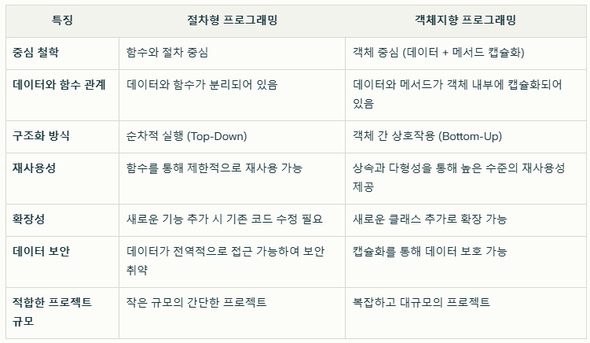

**프로그래밍** : 컴퓨터에게 명령을 내려 작업 수행하게 하는 

**패러다임**: 틀이나  체계

> **프로그래밍을 어떻게 할것인가?**

 

[방법과 목적에 따라 분류]

### 1. 선언, 명령 → 사고에 대한 틀

 

**명령형 접근 = 어떻게 ,** 

> 목표, 주의사항 설정, 세부 과정

 

**선언형 접근 = 무엇을 ,     할 것인가?**

> 목표, 지시

 

→ 세부 지시사항, 절차를 미리 학습한(추상화) 상태라 가정이 되어야 함

 

### 2. 절차, 객체, 함수 → 설계에 대한 틀

등장 순서: 함수형 → 객체 지향 → 절차지향

각각은 장단점이 존재하며, 상호보완적 특성을 갖는다.

 

## 명령형 프로그래밍

### 절차 지향

순차적(위에서 아래로 흘러가는 구조)과 다름.

절차 지향 ⇒ 절차적 프로그래밍이 더 어울림

순수 함수들을 블록처럼 쌓아 로직을 구현하고 ‘고차 함수’를 통해 재사용성을 높인 프로그래밍 패러다임.

**고차함수**: 함수를 인자로 받거나 함수를 반환하는 함수

장점

- 목표( 큰 기능) 처리를 위해, 작은 단위의 기능을 구조화
    - 특정기능 재활용 할 수 있다는 장점
- 코드의 가독성이 높아짐
    - 호출하여 특정 기능만 결과 확인 가능

한계점

- 구조화 과정이 오래걸림, 복잡함
- 순서가 바뀌거나 하면 오류 가능성 높음

 

### 객체 지향 OOP

여러 개의 독립된 단위, 즉 ‘객체’들의 모임으로 파악하고자 하는 것이다.

객체들의 집합으로 프로그램의 **상호작용**을 표현

→ 데이터를 객체로 취급하여 객체 내부에 선언된 메서드를 활용하는 방식

 

: 데이터의 구조화

절차적 프로그래밍에서

데이터 그 자체로서의 구조화

하향식 → **상향식**으로써 조합을 토대로 문제를 해결

OOP  기억나나요?

객체란 클래스란 틀을 이용한 실체화 과정을 거쳐 탄생함

그룹핑 하고, 복잡도를 낮추는것

 

**단점:**

 많은 시간이 걸림. 

why? 설계에 많은 시간소요, 처리속도 느림

<aside>
💡

그럼 객체란?

</aside>

객체란 , 속성과 행위(행동)을 가진 실체.

속성 → 객체가 스스로 나타낼 수 있는 특징: **변수**

행위 → 객체가 할 수 있는 역량이나 동작: **메서드**

> 모든 인스턴스는 객체이지만, 모든 객체가 인스턴스는 아님
> 
 

### 객체지향 프로그래밍 4가지 특징

1. 추상화
2. 캡슐화
3. 상속성
4. 다형성

### 추상화

인스턴스로의 실체화를 위해 공통된 속성과 행위를 추출하고 정의하는 것

클래스: 추상화

인스턴스: 실체화

### 캡슐화

추상화를 목표로 속성과 행위를 ‘캡술’처럼 결합하는 것

속성과 행위를 하나로 묶어낸다

내부정보를 노출시키지 않는 ‘정보은닉’을 활용

드러내지 않고, 감춰서 접근 제어가능

너무 많은 정보 노출 시킬 필요 없음

### 상속성

클래스의 속성과 행위를 다른클래스가 물려받아 동일하게 사용

재사용성과 확장성

### 다형성

상속받은 클래스에서 다양한 형태로 기능 재정의

**방법**:

1. 오버라이딩
2. 오버로딩

1. 오버라이딩
    
    상위 클래스의 메서드를 하위 클래스에서 **재정의**
    
    쓰임에 맞지 않다 생각되면, 하위클래스 원하는대로 
    
2. 오버로딩
    
    동일한 이름을 가지고 있는 메서드가 존재하면
    
    매개변수의 이름, 타입, 갯수의 차이에 따라 구별되며, 다르게 동작
    
    파이썬 오버로딩 안되는 언어?
    
    공식적으로 맞음, 가변인자로 구현은 가능하다고 함.

 

### 설계 원칙
#### SOLID
1. Single resposibility principle

**단일책임의 원칙**

: 모든 클래스는 각각 하나의 책임 만을 갖는다.

 

2. Open closed principle

**개방 폐쇄 원칙**

: 유지보수 사항이 생긴다면, 

코드를 쉽게 확장하도록 열려있어야하고,

수정할때는 닫혀있어야 한다.

 

3. Liskov substitution principle

**리스코프 치환 원칙**

: 객체가 프로그램의 정확성을 깨뜨리지 않으면서 하위 타입의 인스턴스로 바꿀 수 있어야 함

 

4. Interface segregation principle

**인터페이스 분리 원칙**

: 하나의 일반적인 인터페이스 보다는 구체적인 여러개의 인터페이스를 만들라

 

5. Dependency inversion principle

**의존 역전 원칙**

: 추상화된 인터페이스나 상위 클래스를 두어 변하기 쉬운 것의 (변화에) 영향을 받지 않게 하는 원칙

 

## 요약 = 차이점 비교

## 선언형 프로그래밍

### 함수형

상태값을 지니지 않는 함수값들의 연속

데이터와 함수의 결합, 수학적 함수의 개념에 기반

 

순수 함수와 불변성을 강조. 프로그램의 상태변경을 최소화를 목표로 함

코드의 간결성, 모듈성 및 예측 가능성을 높임

단, 어려워. 하면 쉬워지긴하는데.

 

> JS는 단순하고 유연하여, 함수가 일급객체이기 때문에 함수형 프로그래밍 방식을 선호함

 

+ 일급객체: 

    - 변수나 메서드에 함수를 할당 가능
    - 함수 안에 함수를 매개 변수로 담기 가능
    - 함수가 함수를 반환함

 

[참고]
- perplexity, gpt 참고

- [망나니개발자티스토리](https://mangkyu.tistory.com/111)

- [코드블로그](https://www.codestates.com/blog/content/%EA%B0%9D%EC%B2%B4-%EC%A7%80%ED%96%A5-%ED%94%84%EB%A1%9C%EA%B7%B8%EB%9E%98%EB%B0%8D-%ED%8A%B9%EC%A7%95)