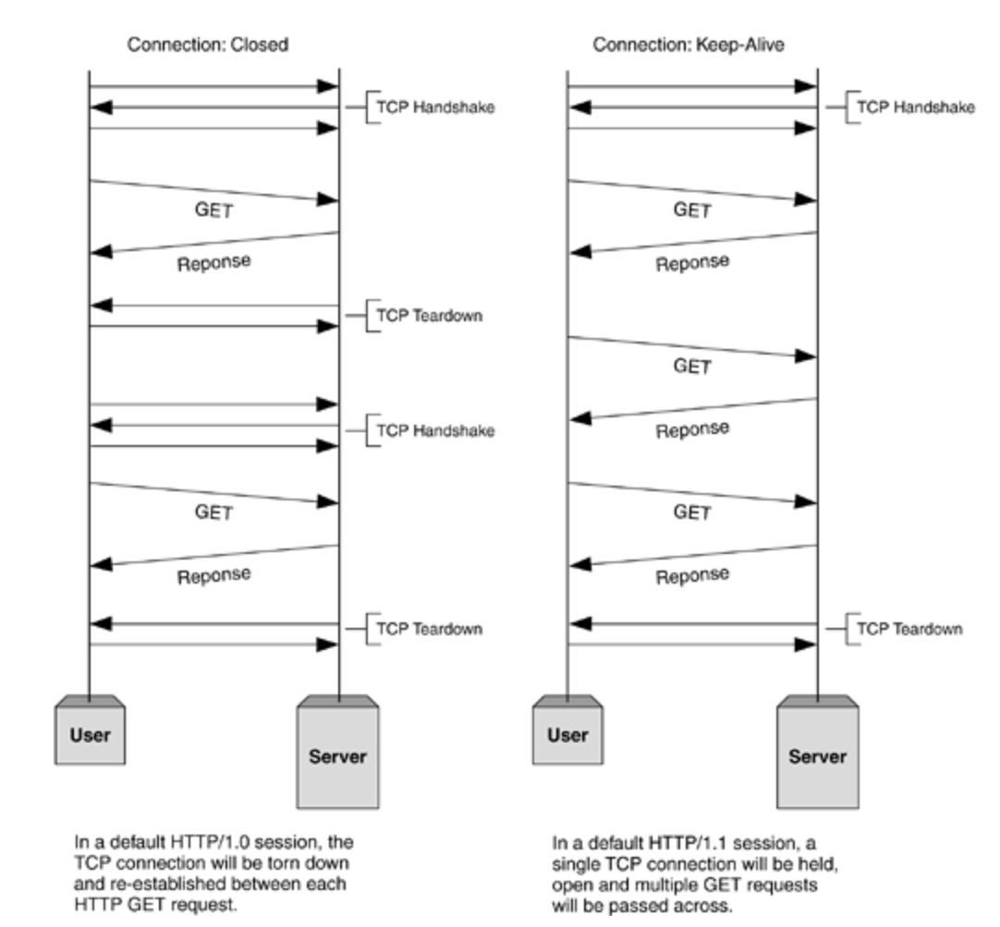

# 네트워크 기기

날짜1: 2025년 4월 23일
번호: 2.3 장

# 네트워크 기기

## 네트워크 기기의 처리 범위

## 애플리케이션 계층을 처리하는 기기

### L7 스위치

**스위치는** **여러 장비를 연결하고 데이터 통신을 중재하며 목적지가 연결된 포트로만 전기 신호를 보내 데이터를 전송하는 통신 네트워크 장비**이다. 이 중 **L7 스위치는** **로드밸런서라고도 하며, 서버의 부하를 분산하는 기기**이다. 클라이언트로부터 오는 요청들을 뒤쪽의 여러 서버로 나누는 역할을 하며 **시스템이 처리할 수 있는 트래픽 증가를 목표**로 한다.

**URL. 서버. 캐시, 쿠키들을 기반으로 트래픽을 분산**한다. 또한 바이러스, 불필요한 외부 데이터 등을 걸러내는 **필터링 기능** 또한 가지고 있으며 응용 프로그램 수준의 **트래픽 모니터링도 가능**하다. 

만약 장애가 발생한 서버가 있다면 이를 트래픽 분산 대상에서 제외해야 하는데, 이는 정기적으로 **헬스 체크**를 이용하여 감시하면서 이루어진다. 

*** L4 스위치와 L7 스위치 차이**

로드밸런서로는 L7 스위치뿐만 아니라 L4 스위치도 있다. **L4 스위치는 전송 계층을 처리하는 기기**로 스트리밍 관련 서비스에서는 사용할 수 없고 메시지를 기반으로 인식하지 못하고 **IP와 포트를 기반으로 (특히 포트) 트래픽을 분산**한다.

클라우드 서비스에서 L7 스위치를 이용한 로드밸런싱은 **ALB 컴포넌트**라고 하며, L4 스위치를 이용한 로드밸런싱은 **NLB 컴포넌트**라고 한다.

***헬스 체크**

L4 스위치 또는 L7 스위치 모두 헬스 체크를 통해 정상적인 서버 또는 비정상적인 서버를 판별하는데, **헬스체크는 전송 주기와 재전송 횟수 등을 설정한 이후 반복적으로 서버에 요청을 보내는 것**을 말한다. 물론 이때 서버에 부하가 되지 않을 만큼 요청 횟수가 적절해야 히며, 다양한 방법으로 요청을 보내어 이 요청이 정상적으로 이루어졌다면 정상적인 서버로 판별한다.   

*로드밸런서를 이용한 서버 이중화

**로드밸런서는 대표적인 기능으로 서버 이중화**를 들 수 있다. 서비스를 안정적으로 운용하기 위해서는 2대 이상의 서버는 필수적이다. 에러가 발생하여 서버 1대가 종료되더라도 서비스 안정적으로 운용되어야 하기 때문이다. 

**로드밸런서는 2대 이상의 서버를 기반으로 가상 IP를 제공하고 이를 기반으로 안정적인 서비스를 제공**한다. 

## 인터넷 계층을 처리하는 기기

### 라우터

**라우터는 여러 개의 네트워크를 연결, 분할, 구분시켜주는 역할**을 하며 **“다른 네트워크에 존재하는 장치끼리 서로 데이터를 주고 받을 때 패킷 소모를 최소화하고 경로를 최적화하여 최소 경로로 패킷을 포워딩”** 하는 라우팅을 하는 장비이다. 규모에 따라 라우팅 장치 형태가 상이하다. 

### L3 스위치

**L3 스위치란 L2 스위치 + 라우터 인 장비**로 이해할 수 있다. L3 스위치를 라우터라고 해도 무방하다. 라우터는 소프트웨어 기반의 라우팅과 하드웨어 기반의 라우팅을 하는것으로 나누너지고 **하드웨어 기반의 라우팅을 담당하는 장치를 L3 스위치**라고 한다. 

## 데이터 링크 계층을 처리하는 기기

### L2 스위치

**L2 스위치는 장치들의 MAC 주소를  MAC 주소 테이블을 통해 관리하며, 연결된 장치로부터 패킷이 왔을 때 패킷 전송을 담당**한다. IP 주소를 이해하지 못해 IP 주소를 기반으로 라우팅은 불가능하며 단순히 패킷의 MAC주소를 읽어 스위칭하는  역할을 한다. 목적지가 MAC 주소 테이블에 없다면 전체 포트에 전달하고 MAC 주소 테이블의 주소는 일정 시간 이후 삭제하는 기능도 있다.  

### 브리지

**브리지는 두 개의 근거리 통신망을 상호 접속할 수 있도록 하는 통신망 연결 장치**로, 포트와 포트 사이의 다리 역할을 하며 장치에서 받아온 MAC 주소를 MAC 주소 테이블로 관리한다. 브리지는 통신망 범위를 확장하고 서로 다른 LAN 등으로 이루어진 하나의 통신망을 구축할 때 쓰인다. 

## 물리 계층을 처리하는 기기

### NIC

(위의 그림이 NIC 카드이다. 빨간색 박스로 표시된 포트에 이더넷 케이블(랜선)을 연결)

**LAN 카드라고 하는 네트워크 인터페이스 카드는 2대 이상의 컴퓨터 네트워크를 구성하는 데 사용하며, 네트워크와 빠른 속도로 데이터를 송수신할 수 있도록 컴퓨터 내에 설치하는 확장 카드**이다. 각 LAN 카드에는 주민등록번호처럼 각각을 구분하기 위한 고유의 식별번호 MAC 주소가 있다.  

### 리피터

리피터는 **들어오는 약해진 신호 정도를 증폭하여 다른 쪽으로 전달하는 장치**이다. 이를 통해 패킷이 더 멀리 갈 수 있지만 광케이블이 보급됨에 따라 현재는 잘 쓰이지 않는 장치이다. 

### AP

AP(Access Point)는 **패킷을 복사하는 기기**이다. 

AP에 유선 LAN을 연결한 후 다른 장치에서 무선 LAN 기술(와이파이 등을 사용하여 무선 네트워크 연결을 할 수 있다. 

---

# 참고자료 📖

[L4/L7 로드밸런싱 쉽게 이해하기](https://aws-hyoh.tistory.com/149)

[L3 Switch](https://velog.io/@gntjd135/L3-Switch)

[IT위키](https://itwiki.kr/w/%EB%8C%80%EB%AC%B8)

[NIC이란 무엇인가?](https://jettstream.tistory.com/345)