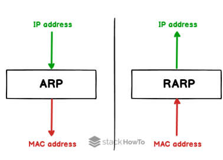

# IP 주소

날짜1: 2025년 4월 23일
번호: 2.4 장

# IP 주소

## 컴퓨터 간의 통신

컴퓨터와 컴퓨터 간의 통신은 흔히 IP 주소 기반으로 통신한다고 알고 있지만 정확히 이야기하자면 IP 주소에서 ARP를 통해 MAC 주소를 찾아 MAC 주소를 기반으로 통신한다. 

## ARP, RARP

ARP(Address Resolution Protocol)란 IP 주소로부터 MAC 주소를 구하는 IP와 MAC 주소의 다리 역할을 하는 프로토콜이다. ARP를 통해 가상 주소인 IP 주소를 실제 주소인 MAC 주소로 변환한다. 이와 반대로 RARP를 통해서 실제 주소인 MAC 주소를 가상 주소인 IP 주소로 변환하기도 한다. 

*브로드캐스트: 송신 호스트가 전송한 데이터가 네트워크에 연결된 모든 호스트에 전송되는 방식

*유니캐스트: 고유 주소로 식별된 하나의 네트워크 목적지에 1:1로 데이터를 전송하는 방식

## 홉바이홉 통신

IP 주소를 통해 통신하는 과정을 홉바이홉 통신이라고 한다. 여기서 홉(hop)이란 영어 뜻 자체로는 건너뛰는 모습을 의미한다. 이는 통신망에서 각 패킷이 여러 개의 라우터를 건너가는 모습을 의미한다. 이는 통신망에서 각 패킷이 여러 개의 라우터를 건너가는 모습응ㄹ 비유적으로 표현한 것이다. 다음 그림처럼 수많은 서보네트워크 안에 있는 라우터의 라우팅 테이블 IP를 기반으로 패킷을 전달하고 또 전달해나가며 라우팅을 수행하며 최종 목적지까지 패킷을 전달한다.  즉, 통신 장치에 있는 ‘라우팅 테이블’의 IP를 통해 시작 주소부터 시작하여 다음 IP로 계속해서 이동하는 라우팅 과정을 거쳐 패킷이 최종 목적지까지 도달하는 통신을 말한다. 

*라우팅: IP 주소를 찾아가는 과정 

### 라우팅 테이블

라우팅 데이블은 송신지에서 수신지까지 도달하기 위해 사용되며 라우터에 들어가 있는 목적지 정보들과 그 목적지로 가기 위한 방법이 들어 있는 리스트를 뜻한다. 라우팅 테이블에는 게이트워이와 모든 목적지에 대해 해당 목적지에 도달하기 위해 거쳐야 할 다음 라우터의 정보를 가지고 있다. 

### 게이트 웨이

게이트웨이는 서로 다른 통신망, 프로토콜을 사용하는 네트워크 간의 통신을 가능하게 하는 관문 역할을 하는 컴퓨터나 소프트웨어를 두루 일컫는 용어이다.  사용자는 인터넷에 접속하기 위해 수많은 톨게이트인 게이트웨이를 거쳐야 하며 게이트 웨이는 서로 다른 네트워크 상의 통신 프로토콜을 변환해주는 역할을 하기도 한다. 게이트웨이를 확인하는 방법은 라우팅 테이블을 통해 볼 수 있으며, 라우팅 테이블은 윈도우의 명령 프롬프트에서 ‘netstat -r’ 명령어를 실행하여 확인할 수 있다. 

## IP 주소 체계

IP 주소는 IPv4와 IPv6로 나뉜다. IPv4는 32빋트를 8비트 단위로 점을 찍어 표기하며, 123.45.67.89 같은 방식으로 IP주소를 나타낸다. IPv6은 64비트를 16비트 단위로 점을 찍어 표기하며, 2001:db8:ff00:42:8329 같은 방식으로 IP주소를 나타낸다. 

추세는 IPv6로 가고 있지만 현재 가장 많이 쓰이는 주소 체계는 IPv4이다. 

*IPv6이 기술적으로 훨씬 우수하다. 주소 공간이 거의 무한대이며, NAT 필요가 없고, 더 나은 보안 구조 내장 등의 장점을 가지고 있으다. 그러나 기존 인프라가 IPv4 위주이고 일반 사용자 체감이 거의 없어 빠른 전환이 이루어지진 않는다. 

글로벌 평균 IPv6 사용률은 약 40~45%이고 대표적으로 미국은 50%이상, 한국은 약 30% 내외이다. 완전한 전환에는 시간이 걸릴 것으로 예상된다. 

### 클래스 기반 할당 방식

IP 주소 체계에서 활용했던 과거 방식으로 A, B, C , D, E 다섯 개의 클래스로 구분하는 방식이다. 앞에 있는 부분을 네트워크 주소, 그 뒤에 있는 부분을 컴퓨터에 부여하는 주소인 호스트 주소로 놓아서 사용한다. 

클래스 A, B, C는 일대일 통신으로 사용, D는 멀티 캐스트 통신, E는 앞으로 사용할 예비용으로 쓰는 방식이다. 

맨 왼쪽에 있는 비트를 ‘구분 비트’라고 한다. 앞의 그림처럼 클래스 A의 경우 맨 왼쪽에 있는 비트가 0이고, B는 10이다. 이를 통해 클래스 간의 IP가 나눠진다. 또한, 네트워크의 첫 번째 주소는 네트워크 주소로 사용되고 가장 마지막 주소는 브로드캐스트용 주소로 네트워크에 속해 있는 모든 컴퓨터에 데이터를 보낼 때 사용된다. 

예로 클래스 A로 12.0.0.0 이란 네트워크를 부여 받았다고 가정한다면 다음과 같다. 12.0.0.1~12.255.255.254의 호스트 주소를 부여 받은 것이다. 이때 브로드 캐스트 주소는 12.255.255.255이다. 

이 방식은 사용하는 주소보다 버리는 주소가 많은 단점이 있어, 이를 해소하기 위해 DHCP와 IPv6, NAT이 나온다.   

### DHCP

DHCP(Dynamic Host Configuration Protocol)는 IP주소 및 기타 통신 매개변수를 자동으로 할당하기 위한 네트워크 관리 프로토콜이다. 이 기술을 통해 네트워크 장치의 IP주소를 수동으로 설정할 필요 없이 인터넷에 접속할 때 마다 자동으로 IP 주소를 할당할 수 있다. 

많은 라우터와 게이트웨이 장비에 DHCP 기능이 있으며 이를 통해 대부분의 가정용 네트워크에서 IP 주소를 할당한다. 

### NAT

NAT(Network Address Translation)는 패킷이 라우팅 장치를 통해 전송되는 동안 패킷의 IP 주소 정보를 수정하여 IP 주소를 다른 주소로 매핑하는 방법이다. IPv4 주소 체계만으로는 많은 주소들을 모두 감당하지 못하는 단점이 있는데, 이를 해결하기 위해 NAT로 공인 IP와 사설 IP로 나눠서 많은 주소를 처리한다. NAT를 가능하게 하는 소프트웨어는 ICS, RRASM Netfilet 등이 있다.

각 사람들은 192.168.0.xxx을 기반으로 각각 다른 IP를 가지고 있다. 이를 사설 IP라고 하며 NAT 장치를 통해서 121.165.151.200으로 외부 인터넷을 요청할 수 있다. 이를 통해 각 인원은 하나의 IP를 기반으로 각각 다른 IP를 가지는 것처럼 인터넷을 사용할 수 있다. NAT 장치를 통해서 사설 IP를 공인 IP로 변환하거나 공인 IP를 사설 IP로 변환하는데 쓴다. 

**공유기와 NAT**

NAT를 쓰는 이유는 주로 여러 대의 호스트가 하나의 공인 IP 주소를 사용하여 인터넷에 접속하기 위함이다. 예를 들어 인터넷 회선 하나를 개통하고 인터넷 공유기를 달아서 여러 PC를 연결하여 사용할 수 있는데, 이것이 가능한 이유는 인터넷 공유기에 NAT 기능이 탑재되어 있기 때문이다.

**NAT를 이용한 보안**

NAT를 이용하면 내부 네트워크에서 사용하는 IP 주소와 외부에 드러나는 IP주소를 다르게 유지할 수 있기 때문에 내부 네트워크에 대한 언느 정도의 보안이 가능하다. 

**NAT의 단점**

NAT는 여러 명이 동시에 인터넷을 접속하게 되므로 실제 접속하는 호스트 숫자에 따라 접속 속도가 느려질 수 있다. 

## IP 주소를 이용한 위치 정보

IP 주소는 인터넷에서 사용하는 네트워크 주소이기 때문에 이를 통해 동 또는 구까지 위치 추적이 가능하다. 

---

# 참고자료 📖

[면접을 위한 CS 전공지식 노트: 2.4.3 IP 주소 체계 - 4](https://thebook.io/080326/0118/)
