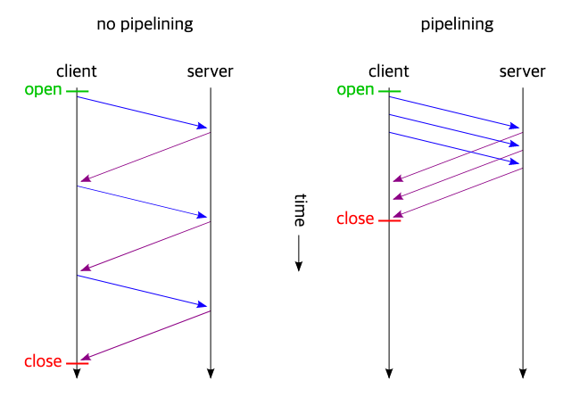
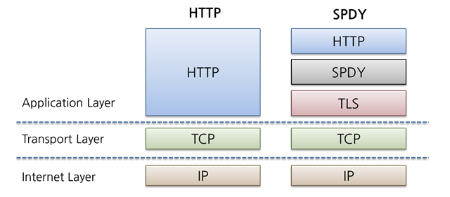
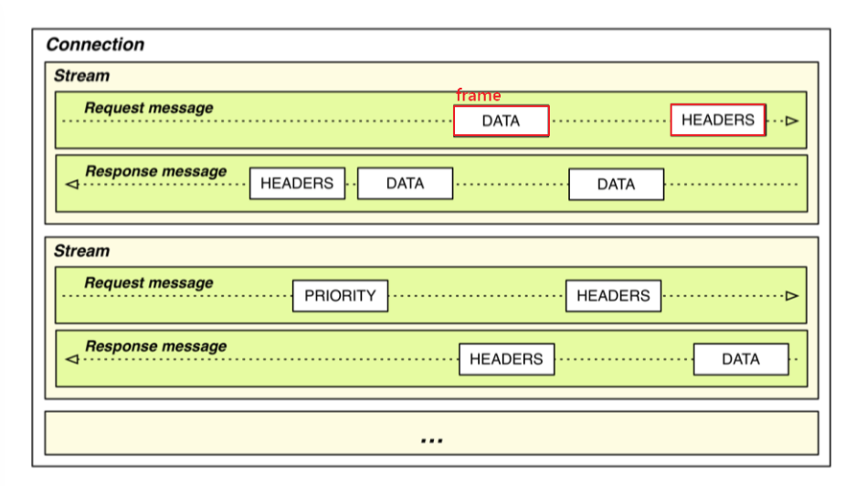
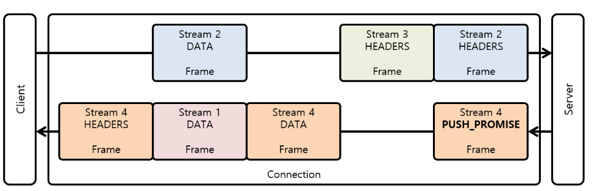
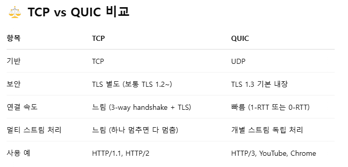

HTTP 환경 - 어플리케이션 계층. 웹서비스 통신에 사용


## 1. HTTP/1.0
한 연결 당 하나의 요청 처리
-> RTT의 증가 의 원인

* RTT

  패킷이 목적지에 도달하고 나서 다시 출발지로 돌아오기까지 걸리는 시간
  = 패킷 왕복 시간

### RTT 증가를 해결하는 방법
  
매번 요청 처리 시 RTT 증가 -> 서버 부담, 응답 시간의 길어짐


1. 이미지 스플리팅
=image sprite

   - 많은 이미지를 하나로 합쳐 다운로드
 
1. 코드 압축
   - 코드를 압축해서 개행 문자, 빈칸을 없앰 으로써 코드의 크기를 최소화

2. 이미지 Base64 인코딩
   - 이미지 파일을 64진법으로 이루어진 문자열로 인코딩 하는 방법
   - 그럼 서버를 열고 이미지에 대해 서버에 HTTP요청을 할 필요가 없음
    - 단, 크기가 더 커지는 단점이 있음.

> **인코딩** 이란?

  정보의 형태나 형식을 표준화보안, 처리속도 향상, 저장공간 절약 등을 위해 다른 형태나 형식으로 변환하는 처리방식

## 2. HTTP/1.1
1.0에서 발전. 

### 지속성
매번 TCP연결을 하는 것이 아니라 한 번 TCP 연결 초기화. 
keep-alive (persistence connection)라는 옵션으로 **여러개의 파일** 송수신 가능


<hr>

### 파이프라이닝


요청을 병렬로(한꺼번에 보내서 응답을 받는다) 처리할 수 있음 -> 여러개의 요청을 처리 하여 응답속도가 빨라짐.

단, HOL의 문제 발생
<hr>

### 문제1 : HOL Blocking
Head of line Blocking

FIFO 처리로 인해 발생하는 문제

같은 큐에 있는 패킷이 먼저 있는 패킷에 의해 지연이 발생되는 것 -> 성능 저하 현상

대기상태

<hr>

### 문제2: 무거운 헤더 구조
헤더: 요청과 요청의 응답으로 부가적 정보 전송할 수 있게 함

<예시>
```
# 요청
GET /index.html HTTP/1.1
Host: www.example.com
User-Agent: Mozilla/5.0 (Windows NT 10.0; Win64; x64)
Accept: text/html,application/xhtml+xml,application/xml;q=0.9
Accept-Language: ko-KR,ko;q=0.9
Accept-Encoding: gzip, deflate, br
Connection: keep-alive
```

```
#응답
HTTP/1.1 200 OK
Date: Wed, 23 Apr 2025 12:00:00 GMT
Server: Apache/2.4.41 (Ubuntu)
Content-Type: text/html; charset=UTF-8
Content-Length: 1024
Connection: keep-alive
Cache-Control: no-cache
```

헤더에 쿠키 등의 많은 메타데이터, 압축이 안 되어있는 상태로 무거움


## 3. HTTP/2
HTTP 1버전 보다 지연시간 줄이고 응답시간을 더 빠르게 할 수 있음.

HOL blocking 없이 여러 파일 한번에 병렬 전송 가능

[+] 원조: **SPDY 프로토콜**
HTTP 대체 아니고, HTTP를 통한 전송을 재 정의 하는 형태로 구현.

전송 계층의 구현만 변경해서 사용 했었음





<br>

### 멀티 플렉싱
여러 개의 스트림을 사용하여 송수신
 
> 스트림

시간이 지남에 따라 사용할 수 있게 되는 일련의 데이터 요소를 가리키는 **데이터 흐름**

특정 스트림의 패킷이 손실 되었다 하더라고 해당 스트림에만 영향 끼침

스트림


멀티플렉싱

하나의 커넥션으로 동시에 여러개의 메세지 스트림을 응답 순서에 상관 없이 주고 받음

---

### 헤더 압축
1.1 에서의 헤더 크기의 문제 -> 압축을 써서 해결

WITH **허프만 코딩**

문자열을 문자 단위로 쪼개서 빈도수를 센다.

빈도가 높은 정보는 적은 비트 수를 사용하여 표현하고, 

빈도가 낮은 정보는 비트 수를 맣이 사용하여 표현해서 전체 데이터의 표현에 필요한 비트 양을 줄이는 원리이다.

---
### 서버 푸시
클라이언트 요청 없이 서버가 바로 리소스를 푸시 하는 것

필요한 리소스를 다시 요청하여 발생하게 되는 트래픽, 회전 지연 줄임

---
### 요청의 우선순위 처리 지원
클라이언트가 서버에게 스트림을 보낼 때, 각 요청 자원에 가중치(우선순위)를 저장하고 보낼 수 있다.

---
<br>

## 4. HTTPS
HTTPS란 HTTP에 보안계층(SSL/TLS)을 추가한  **보안** **프로토콜** 이다.

HTTPS는 HTTP/2 위에서 동작함

클라이언트와 서버가 통신 할 때 SSL/TLS를 통해 제 3자가 도청 및 변조하는 것을 막는다.
(네트워크 상의 인터셉터를 방지)

SSL/TLS는 보안세션을 기반으로 데이터를 암호화하며 보안 세션이 만들어질 때 인증 메커니즘, 키교환 암호화 알고리즘, 해싱 알고리즘 등이 사용된다.

<br>

- **보안 세션**

보안이 시작되고 끝나는 동안 유지되는 세션.

**핸드셰이크를** 통해 보안 세션을 생성하고, 이를 기반으로 상태 정보 등을 공유한다.

-> 안전하게 대화 시작하기 전, 어떻게 암호화할지 미리 약속하는 과정

서버와 키 공유, 인증, 인증 확인 등의 절차


> 세션

운영체제가 어떠한 사용자로부터 자신의 자산 이용을 허락하는 일정한 기간.

>핸드셰이크 과정

- 클라이언트가 자신이 지원하는 사이퍼 슈터를 서버에 전달

- 받은 사이퍼 슈트의 암호화 알고리즘 제공 여부 확인

- 제공 가능 시 인증 메커니즘 시작

- 해싱 알고리즘 등으로 암호화된 데이터의 송수신


### 사이퍼 슈트
프로토콜, AEAD 사이퍼 모드, 해싱 알고리즘이 나열된 규약.

암호화에 사용할 알고리즘들의 조합

다섯개가 있음.

예)
```
ClientHello:
  Cipher Suites:
    - TLS_AES_128_GCM_SHA256
    - TLS_AES_256_GCM_SHA384
    - TLS_CHACHA20_POLY1305_SHA256
# 클라이언트가 이런식으로 서버에게 보내면
```
```
ServerHello:
  Chosen Cipher Suite: TLS_AES_128_GCM_SHA256
# 서버는 이 중 하나를 골라 응답하고, 이를 기준으로 보안 통신 시작
```

예를 들어

TLS_AES_128_GCM_SHA256
는 세가지 규약을 지니고 있음

1. TLS => 프로토콜
1. AES_128_GCM => AEAD 사이퍼 모드 
2. SHA256 => 해싱 알고리즘

### AEAD 사이퍼 모드 
AEAD: 데이터 암호화 알고리즘.

AES_128_GCM 
  - 128비트의 키를 사용하는 표준 블록 암호화 기술 + 병렬 계산에 용이한 암호화 알고리즘 GCM


### 인증 메커니즘
CA (certificate Authorities)에서 발급한 인증서를 기반으로, 안전한 연결할 수 있는 서버임을 보장함.

신뢰성이 엄격하게 공인된 기업들만 CA 자격

- CA 발급과정
  - 자신의 서비스가 CA 인증서를 발급받으려면 
  - 사이트 정보와 공개키를 CA에 제출
  - CA는 공개키를 해시한 값인 지문을 사용하는 
  CA의 비밀키 등을 기반으로 CA 인증서를 발급

- 개인키 = 비밀키
  - 개인이 소유하고 있는 키, 반드시 자신만이 소유
- 공개키 
  - 공개되어있는 키

### 암호화 알고리즘
1. ECDHE 대수곡선 기반

2. DHE 모듈식 기반

둘 다 DH 디피-헬만 방식으로 만들어짐

- 디피-헬만 키 교환 암호화 알고리즘
  - 암호키를 교환하는 방법
  - 공개키 비밀키 혼합 -> 혼합 값 공유하고 또 자기 비밀 값과 혼합 => PSK 공통 암호키 생성...~~ 

### 해싱 알고리즘

데이터를 추정하기 힘든 더 작고, 섞여있는 조각으로 만드는 것

- **SHA-256**
  - 해시 함수 결과값이 256비트인 알고리즘
  - 비트코인 등의 블록체인 시스템에서 사용
  - 해싱할 메시지 전처리 후 해시를 반환

- 해시
  
  다양한 길이를 가진 데이터를 **고정된 길이**를 가진 데이터로 매핑한 값
- 해싱

  임의의 데이터를 해시로 바꿔주는 것 with 해시함수

- 해시 함수
  임의의 데이터를 입력으로 받아 일정한 길이의 데이터로 바꿔주는 함수

---  
### SEO 
HTTPS 서비스를 하는 사이트가 그렇지 않은 사이트보다 SEO 순위가 높음

  SEO(**검색엔진 최적화**) -> 사용자들이 구글 네이버으로 웹사이트 검색 시에 그 결과를 페이지 상단에 노출 시키는 것

### HOW?
1. 캐노니컬 설정
2. 메타 설정
3. 페이지 속도 개선
4. 사이트맵 관리

<br>

- 캐노니컬
  - 중복된 페이지들 중 '대표 URL'을 검색엔진에 알려주는 방법

- 메타설정
  - html의 가장 윗 부분 메타.
  - head 안에 작성
  - title 이나, 설명, 로봇 태그 등
   ``` python
   #title
  <title>GPTOnline - AI와 함께하는 웹 개발 배우기</title>
  # 설명
  <meta name="description" content="GPTOnline은 웹 개발, AI, 보안, SEO에 대해 쉽게 배우는 한국어 플랫폼입니다.">
  # 로봇 지시어
  <meta name="robots" content="index, follow">
  ```
  이런 식으로 설정 시  검색결과를 SEO에 적합하게 함 


- 페이지 속도 개선
  - 사이트의 속도가 빠르도록 함

- 사이트 맵 관리
  - 정기적인 관리 필요
  
---

## HTTPS 구축 방법
1. CA에서 구매한 인증키를 기반으로 HTTPS 서비스 구축
2. 서버 앞단에 HTTPS 를 제공하는 로드밸런서(트래픽 분산 장치)를 둠
3. 서버 앞단에 HTTPS를 제공하는 CDN을 두어 구축


> [정리]
> 
> **HTTPS가 필요한 이유는?**

데이터 암호화: 개인정보, 로그인 정보 등을 보호

신뢰성 확보: 브라우저 주소창에 자물쇠 표시

검색엔진 가산점: SEO 측면에서도 유리

---

## HTTP/3
TCP 위에서가 아닌 

QUIC 계층에서 돌아감
UDP 기반으로.

차세대 인터넷 통신 방식이라고 생각하면 됨



HTTP/2처럼 멀티플렉싱 가지고 있음.

### 초기 연결 설정 시 지연시간 감소
TCP를 사용하지 않기에 **3-웨이 핸드셰이크** 과정 없음

> 3-웨이 핸드셰이크
- 클라이언트와 서버가 TCP 연결을 만드는 절차
- 
  세번 왔다갔다 함

<br>
첫 연결에 1-RTT만 소요되고,

클라이언트가 신호를 보내고 서버가 응답하기만 하면 통신 가능

**FEC**  전진 오류수정 메커니즘 적용됨.
- 패킷 손실에 대한 복구, 
- 추가적인 재전송 없이 **수신자**가 일부 복구 가능 -> 전송 속도 빠름


출처:
https://inpa.tistory.com/entry/WEB-%F0%9F%8C%90-HTTP-20-%ED%86%B5%EC%8B%A0-%EA%B8%B0%EC%88%A0-%EC%9D%B4%EC%A0%9C%EB%8A%94-%ED%99%95%EC%8B%A4%ED%9E%88-%EC%9D%B4%ED%95%B4%ED%95%98%EC%9E%90

https://giron.tistory.com/139