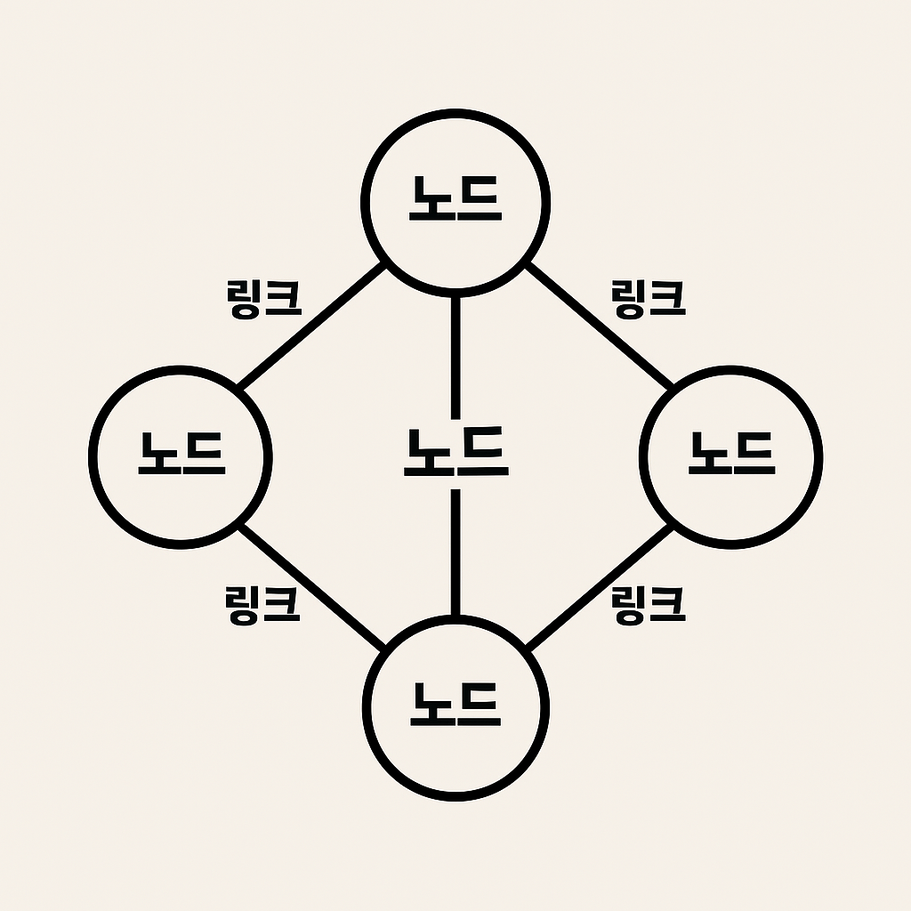

# 네트워크 기초

**네트워크란?** 
 
노드 + 링크의 집합체

- **노드**: 네트워크 장치 (서버, 라우터, 스위치 등)
- **링크**: 유선 / 무선 연결

---

## 처리량과 지연 시간

### ✅ 좋은 네트워크의 조건
- 처리량(throughput) 우수
- 지연 시간 짧음
- 장애 빈도 낮음
- 보안 우수

### 📦 처리량 (Throughput)
- 시간당 전달 가능한 데이터 양
- **단위**: bps (bits per second)

**처리량에 영향을 주는 요소**
- 트래픽 (사용량)
- 장치 간 대역폭
- 전송 중 에러 발생률
- 장치의 하드웨어 스펙

### 🕒 지연 시간 (Latency)
- 요청이 처리되는 데 걸리는 시간  
  → 메시지가 두 장치 간 **왕복**하는 데 걸리는 시간

**지연 시간에 영향을 주는 요소**
- 전송 매체 (유선 / 무선)
- 패킷 크기
- 라우터의 처리 속도

---

## 네트워크 토폴로지 & 병목 현상

### 📌 네트워크 토폴로지란?
> 노드와 링크가 **어떻게 연결되어 있는지**, 즉 **네트워크의 구조**

---

### 1. 트리 토폴로지 (계층형)

- 노드 추가/삭제 용이
- 트래픽 집중 시 하위 노드 영향

---

### 2. 버스 토폴로지

> **하나의 회선**에 여러 노드가 직렬로 연결된 구조 (LAN에서 사용)

- 설치 비용 저렴
- 노드 추가/삭제 쉬움
- 신뢰성 우수
- **스푸핑에 취약**

#### ❗ 스푸핑(Spoofing)이란?
: 신분을 속이거나 허위 정보를 보내는 공격 기법  
→ 통신을 가로채거나 위조할 수 있음

- 버스 토폴로지는 **모든 노드가 같은 회선**을 공유
- 패킷이 지나갈 때 **목적지가 아니어도** 수신 가능
- → 도청, 위장, 스푸핑 발생 가능

---

### 3. 스타 토폴로지

> **중앙 노드**를 기준으로 모든 노드가 연결된 구조

- 노드 추가 용이
- 패킷 충돌 가능성 낮음
- 중앙 노드 장애 시 전체 네트워크 영향
- 설치 비용 비교적 높음

---

### 4. 링형 토폴로지

> 각 노드가 양 옆 노드와 연결된 원형 구조

- 노드 수가 많아도 데이터 손실 적음
- 충돌 적고 탐색 용이
- 구성 변경 어려움
- 회선 하나만 문제 생겨도 전체 영향

---

### 5. 메시 토폴로지

> 망형 구조 (스타형 + 링형의 결합)

- 우수한 안정성 / 트래픽 분산 가능
- 노드 추가 어려움
- 설치 및 유지 비용 높음

---

### ❓ 왜 토폴로지가 중요할까?

→ **병목 현상**의 위치를 파악하기 위해! 

---

## 병목 현상이란?

: 하나의 구성 요소(노드 or 링크)로 인해 **전체 시스템의 성능**이 제한되는 현상

**원인**
- 대역폭 부족 (링크)
- 비효율적인 네트워크 구조 (토폴로지)
- 서버 CPU/메모리 과부하 (노드)

---

## 네트워크의 종류

### 네트워크 분류는 '규모'를 기준으로 분류

### 1. **LAN** (Local Area Network)
- 범위: 수 m ~ 수 km
- 구성: 스위치 + 이더넷 / Wi-Fi
- 예시: 가정, 학교, 소규모 회사

### 2. **MAN** (Metropolitan Area Network)
- 범위: 수십 km (도시 규모)
- 구성: 광케이블, 여러 LAN의 집합
- 예시: 지자체망, 대학 캠퍼스, 지하철 와이파이

### 3. **WAN** (Wide Area Network)
- 범위: 수백 km ~ 전 세계
- 구성: 위성, 해저 케이블 등
- 예시: 인터넷, 글로벌 기업 통신망

---

## 네트워크 성능 분석 명령어

### 병목현상을 해결하기 위해선, *'네트워크로부터 발생한 문제'*인지를 알아야 함

### 1. `ping`
- 대상 노드에 패킷을 보내 연결 상태 및 응답 시간 확인
- **ICMP 프로토콜**을 이용  
⚠️ 일부 장비는 ICMP를 차단하기도 함

---

### 2. `netstat`
- 현재 접속된 네트워크 연결 상태, 포트, 프로토콜 등 확인

---

### 3. `nslookup`
- 특정 도메인에 매핑된 IP 주소 확인
- **DNS (Domain Name System)**:  
  도메인 이름을 IP 주소로 변환하는 시스템

---

### 4. `tracert`
- 목적지까지 가는 네트워크 경로 확인 (라우터 경유지 추적)
- 지연 시간 발생 구간 확인 가능

---

## 네트워크 프로토콜 표준화

### 📌 프로토콜이란?
: 장치들 간 **데이터 송수신을 위한 공통된 규칙(인터페이스)**

### 왜 표준화가 필요할까?
- 기기간 **호환성** 보장
- **전 세계 네트워크 통합** 가능 (인터넷)
- 새로운 기술 위에 확장/구현 가능 (HTTP, TCP/IP 등)

### 대표 표준화 기관
- **IEEE**: 유선/무선 물리 계층 표준 (ex. 802.11 Wi-Fi)
- **IETF**: 인터넷 표준 프로토콜 (ex. TCP, IP, HTTP)

---
