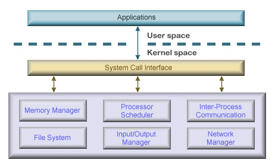

## 1. 운영체제의 역할과 구조
**운영체제**란?

사용자가 컴퓨터를 쉽게 다르게 해주는 인터페이스


### 역할
1. CPU 스케줄링, 프로세스 관리
2. 메모리 관리
3. 디스크 파일 관리
4. I/O 디바이스 관리


### 구조

인터페이스 -> 시스템 콜 -> 커널

- GUI
  - 그래픽 인터페이스
  - 사용자가 상호 작용 할 수 있도록
  - 아이콘과 마우스 클릭 등
  
- 드라이버 
  - 프린터, 키보드 및 디스크 드라이브 등 하드웨어를 제어하기 위한 소프트웨어

- CUI
  - 그래픽이 아닌 명령어로 처리하는 인터페이스

<br>

### 시스템 콜
운영체제가 커널에 접근하기 위한 인터페이스

운영체제의 서비스를 받기 위해 커널 함수를 호출할 때 씀

시스템 자원에 접근하기 위해 시스템 콜을 이용함.

- I/O 요청
  - 입출력 함수, 데이터베이스, 네트웤, 파일 접근 등에 관한 일
  
<br>

### modebit 모드 비트
사용자 모드와 커널 모드를 구분

플래그 변수임. 0과 1을 사용
<br>

- 모드 전환 흐름
 
    - 프로그램이 시스템 콜을 호출함 (read(), write() 등)

    - mode bit가 0 → 1 (User → Kernel)
    → 커널 모드로 진입

    - 커널이 작업 수행

    - 작업 완료 후 mode bit가 1 → 0 (Kernel → User)
    → 사용자 모드로 복귀
    - 0 = 커널, 1 = 사용자

> 커널

운영체제의 핵심 부분이자 시스템콜 인터페이스를 제공, 

보안, 메모리, 프로세스, 파일 시스템, I/O디바이스, I/O 요청관리 등 운영체제의 중추적인 역할

## 2. 컴퓨터 요소
### CPU
산술 논리 연산장치, 제어장치, 레지스터.

메모리에 존재하는 명령어를 해석해서 실행

#### 제어 장치
프로세스 조작을 지시하는 CPU의 한 부품.

입출력장치 간 통신을 제어, 명령어들을 읽고 해석하며 데이터 처리를 위한 순서를 결정

#### 레지스터
CPU 안에 있는 매우 빠른 임시기억 장치

CPU와 직접 연결되어 있어 연산속도가 메모리보다 수백배까지 빠름.

#### 산술 논리 연산 장치
ALU
산술연산과 논리연산을 계산하는 디지털 회로

<br>

**-> CPU 연산 처리 과정**
- 제어장치가 메모리에 계산할 값을 로드
- (레지스터에도 로드)
- 제어장치가 레지스터에 있는 값을 계산하라고 산술논리연산장치에 명령
- 제어장치가 계산된 값을 다시 '레지스터에서 메모리로' 계산한 값을 저장


<hr>

### 인터럽트
어떤 신호가 들어왔을때 CPU를 잠시 정지 시키는것.

인터럽트 발생 시 인터럽트 핸들러 함수가 모여있는 인터럽트 벡터로 가서 인터럽트 핸들러 함수가 실행됨.

> 인터럽트 핸들러 함수
>
인터럽트를 핸들링 하는 함수.

<br>

1. 하드웨어 인터럽트

키보드, 마우스 등의 I/O 디바이스로 인한 인터럽트

'나 좀 처리해줘라' 신호를 보내는 것


2. 소프트웨어 인터럽트
   
= 트랩.

프로세스 오류 등으로 프로세스가 시스템콜을 호출할 때 발동


예시
```
동작 흐름 (키보드 입력 예시)
1. 사용자가 키를 누름 

2. 키보드 장치가 **인터럽트 컨트롤러(Interrupt Controller)**를 통해 CPU에 신호 보냄

3. CPU는 현재 작업을 멈추고 → 커널 모드로 전환 (mode bit 바뀜)

4. 운영체제의 키보드 인터럽트 핸들러 실행

5. 키 입력을 읽어서 메모리에 저장하거나, 처리함
(어떤 키인지 확인, 버퍼 저장, 화면 표시 등)

1. 인터럽트 처리 완료 후 → 원래 하던 작업으로 복귀
```

### DMA 컨트롤러
I/O 디바이스가 메모리에 직접 접근할 수 있도록 하는 하드웨어 장치

CPU에 너무 많은 요청이 들어오면 부하가 걸리는걸 막는 보조 역할.

CPU와 DMA 컨트롤러는 하나의 작업을 동시에 하지 않음

<br>

#### 메모리
데이터나 상태, 명령어 등을 기록하는 장치.

보통 RAM 

기억을 담당.

메모리가 클수록 많은 일을 동시에 가능

<br>

#### 타이머
몇 초 안에는 작업이 끝나야 한다는 것을 정하고, 특정 프로그램에 시간제한을 다는 것.

<br>

#### 디바이스 컨트롤러
컴퓨터와 연결되어 있는 IO디바이스들의 작은 CPU

<br>

**로컬버퍼** : 디바이스 컨트롤러가 갖는 작은 메모리 공간

= 데이터를 임시로 저장하기 위한 작은 메모리


