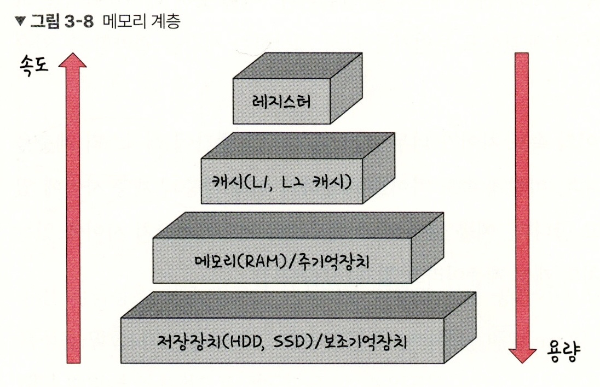
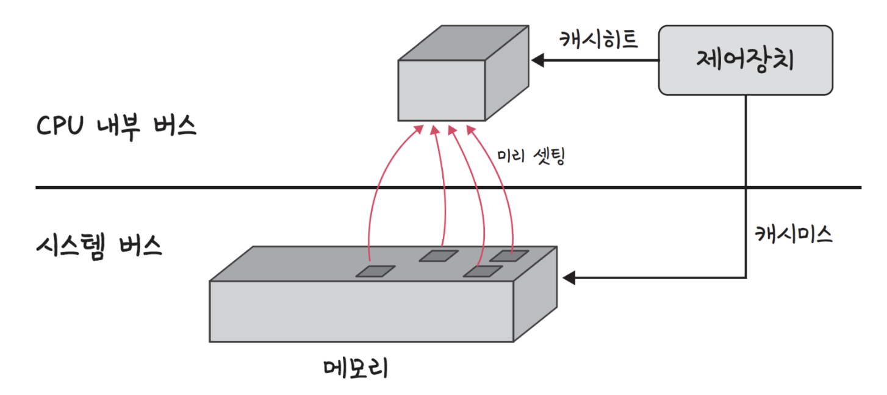
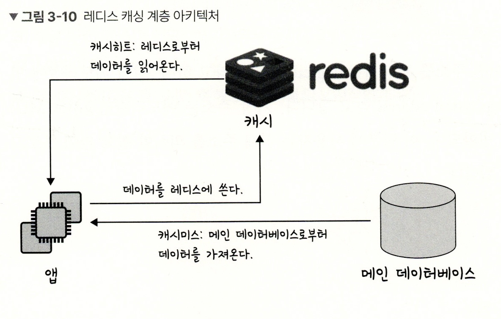
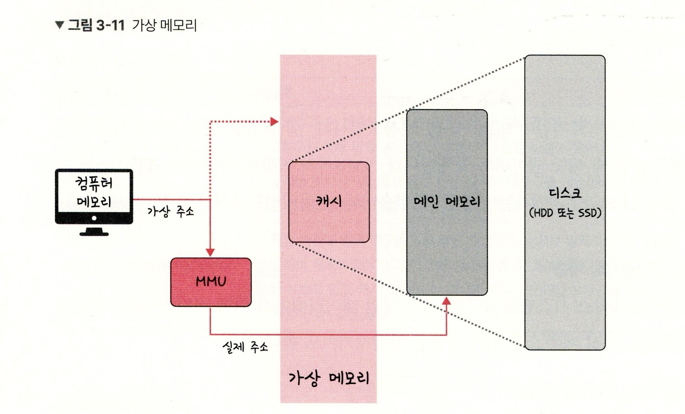

# 메모리

## 메모리 계층

**메모리 계층은 레스터/캐시/메모리/저장장치/ 로 구성**

  

- 레지스터 : 'CPU 안' 메모리, 휘발성, 속도 가장 빠름
- 캐시 : 휘발성, 속도 빠름(L1, L2, +L3)
- 주기억장치 : **RAM** 휘발성, 속도+용량 평균
- 보조기억장치 : '비휘발성', 속도 낮음, 용량 큼(HDD, SSD)    
  
 

> 계층 ⬆️ -> 속도 ⬆️, 용량 ⬇️, 비쌈  
> 원인: -> '경제성'과 '캐시의 효율'

 

### 캐시  
> 데이터를 미리 복사해 놓은 임시 저장소  
> **빠른 장치 - 느린 장치 간의 속도 차이로 인한 '병목 현상' 줄이기 위한 메모리**

#### 📍 캐싱 계층

- 속도 차이 해결을 위해 '계층과 계층 사이'에 있는 계층
- ex : (캐시 메모리, 보조기억장치 사이)의 주기억장치(캐싱계층)

#### 📍 지역성의 원리  
> 지역성 : 자주 사용하는 데이터에 대한 근거

- 시간 지역성
    : '최근 사용한' 데이터에 다시 접근하려는 특성  
    ex) 배열의 인덱스 i

- 공간 지역성
    : '최근 접근한' 데이터를 이루고 있는 공간  
    ex) 배열 자체

 

---

 

### 캐시히트와 캐시미스  

 

- 캐시히트 : 캐시에서 원하는 데이터를 찾았다!  
    CPU  내부 버스 기반 - 속도 빠름

- 캐시미스 : 캐시에 없다면, 주메모리로 가자!(제어장치에서)  
    시스템 버스 기반 - 속도 느림

#### 📍 캐시매핑  
> 캐시가 히트되기 위해 '매핑 하는 방법'   

예) 메모리 '1~100', 캐시 '1~10' 이라면

| 매핑 방식     | 설명                           | 특성                     |
|---------------|--------------------------------|--------------------------|
| 직접 매핑     | 1:1~10, 2:1~10                 | 처리 속도 ⬆️, 충돌 위험 ⬆️ |
| 연관 매핑     | 관련 있는 캐시 메모리로 매핑    | 속도 ⬆️, 충돌 위험 ⬇️     |
| 집합 연관 매핑 | 순서 일치 + 블록 단위 매핑     | 가장 효율적               |

#### 📍 웹 브라우저 캐시  

>사용자 커스텀 정보 or 인증 모듈 관련 사항을 저장  
> 아이덴티티, 중복 요청 방지 위해 사용(origin에 종속)

- 쿠키 : 만료기한이 있는 키-값 저장소
    - 4KB까지 데이터 저장
    - httponly 옵션 걸기
    - 서버에서 만료기한 정함(클라이언트도 가능)  

- 로컬 스토리지 : 만료기한이 없는 키-값 저장소(HTML5 필요)
    - 5MB까지 저장
    - 웹 브라우저 닫아도 유지
    - 클라이언트에서만 수정  

- 세션 스토리지 : 만료기한이 없는 키-값 저장소(HTML5 필요)
    - 탭 단위로 스토리지 생성
    - 탭 닫을 시, 데이터 삭제
    - 클라이언트에서만 수정 가능  

#### 📍 데이터베이스의 캐싱 계층  

> '레디스 데이터 베이스 계층'을 '캐싱 계층'으로  
>  (+메인 데이터베이스 위에 ) 

  

 

---

 

## 메모리 관리  

### 가상 메모리  
> 실제로 '이용 가능한' 메모리 자원을 추상화하여 사용자에게 '매우 큰' 메모리로 보이게 만드는 것  

  

- 가상 주소(logical) : 가상적으로 주어진 주소  
- 메모리 주소(physical) : 실제 메모리 상 주소  
    (+메모리관리장치(MMU)에 의해 실제 주소로 변환)

- TLB : 메모리 - CPU 사이의 주소 변환을 위한 캐시 장치
    - 페이지 테이블의 리스트 보관, 캐시 계층
    - 위치는 MMU(메모리관리장치) 안에 존재  

#### 📍 스와핑  

페이지 폴트  
> 가상 메모리에는 존재하지만, 실제 메모리(RAM)에 없는 데이터, 코드에 접근할 시, 발생하는 현상

**스와핑이란?**  
> 하드디스크의 일부분을 '메모리처럼' 불러와 사용하는 것(페이지 폴트 막기 위해)

- 스와핑 과정
1. 명령어로 가상 주소 접근 -> 페이지 부재 -> 트랩 발생으로 운영체제에 알림
2. 운영체제가 실제 디스크로부터 '사용하지 않는 프레임' 찾음
3. 해당 프레임을 '실제 메모리'에 가져와 '페이지 교체 알고리즘'으로 특정 페이지와 교채(**스와핑 발생**)
4. 페이지 테이블 갱신 후, 명령어 재시작  

> 페이지 : '가상 메모리' 사용하는 최소 크기 단위  
> 프레임 : '실제 메모리' 사용하는 최소 크기 단위

 

---

 

### 스레싱  

**스레싱**  
> 메모리의 '페이지 폴트율'이 높은 것 -> 컴퓨터의 심각한 성능 저하 초래  

(프로세스가 페이지 폴트를 자주 일으켜, 운영체제는 페이지 교체 작업만 하느라 바쁘고, 실제 일은 거의 못하는 상황)

 

**해결방법**  
- 메모리 확대
- HDD -> SDD 변경
- 작업세트 + PFF

#### 📍 작업 세트  

작업 세트(워킹 셋)  
: 프로세스가 일정 시간 동안 '실제로 참조한' 페이지 집합

이 집합들을 '실제 메모리'에 로드해 놓으면  
-> 탐색 비용 절감, 스와핑 감소

#### 📍 PFF

PFF  
: '페이지 폴트 빈도'를 측정해 상한선과 하한선을 만드는 방법  
-> 상한선 도달 시, 프레임 증가 / 하한선 도달 시, 프레임 감소

 

---

 

### 메모리 할당  
> [시작 메모리 위치 / 메모리 할당 크키] 기준으로 메모리에 프로그램 할당

#### 📍 연속 할당  
> 메모리에 '연속적으로' 공간 할당  

- 고정 분할 방식  
: 메모리를 '미리 나누어' 관리  
융통성 x, 내부 단편화 발생  

- 가변 분할 방식  
: 매 시점 프로그램 크기에 맞게 '동적으로' 메모리 나눠서 사용  
외부 단편화 발생 가능o  

 

**가변 분할 방식**

| 방식       | 설명                                                                 |
|------------|----------------------------------------------------------------------|
| 최초 적합  | 위 또는 아래에서 시작해 **처음 발견한 홀**에 할당                   |
| 최적 적합  | 프로세스 크기 이상인 공간 중 **가장 작은 홀**부터 할당             |
| 최악 적합  | 프로세스 크기와 **가장 차이 많이 나는** 홀에 할당                   |

+) 내부 단편화 : 메모리 분할 크기 > 프로그램 -> 들어갈 수x 공간 발생    
+) 홀 : 할당 가능한 '비어있는 메모리 공간'  

 

#### 📍  불연속 할당  

> 현대 운영체제가 쓰는 방법

- 페이징  
: '동일 크기의 페이지 단위'로 나누어 '메모리의 서로 다른 위치'에 프로세스 할당
주소 변환 복잡

- 세그멘테이션  
: 의미 단위인 '세그먼트'로 나누는 방식
장점 -> 공유, 보안 / 단점 -> 홀 크기 불균일

- 페이지드 세그멘테이션  
: 위 두가지 방법 혼합

 

---

 

### 페이지 교체 알고리즘  

> 스와핑이 일어나는 방식

#### 📍 오프라인 알고리즘  

: 먼 미래에 참조되는 페이지 <-> 현재 할당하는 페이지 교환  
(가장 좋은 방법이지만, 실제 사용x '상한 기준'으로써 역할)

> **어떤 페이지를 먼저 제거할까?에 대한 방식**
#### 📍 FIFO

: '가장 먼저 들어 온' 페이지를 가장 먼저 제거

#### 📍 LRU

: '가장 오랫동안 사용되지 않은' 페이지 먼저 제거
성능이 좋지만, 구현이 복잡(참조 시간 기록 + 스택 사용)

+) 해시 테이블 / 이중 연결 리스트로 구현  
해시 테이블 : 이중 연결 리스트에서 빠르게 탐색  
이중 연결 리스트 : 한정된 메모리 표현  

+) NUR 알고리즘(clock 알고리즘)  
: 시계 방향으로 돌며 '0' 찾기 -> 프로세스 교체 '1'로 변환

#### 📍 LFU

: '사용 빈도가 낮은' 페이지를 먼저 제거  
갑자기 필요해진 페이지가 제거될 수o -> 카운트 초기화 시점 주의

