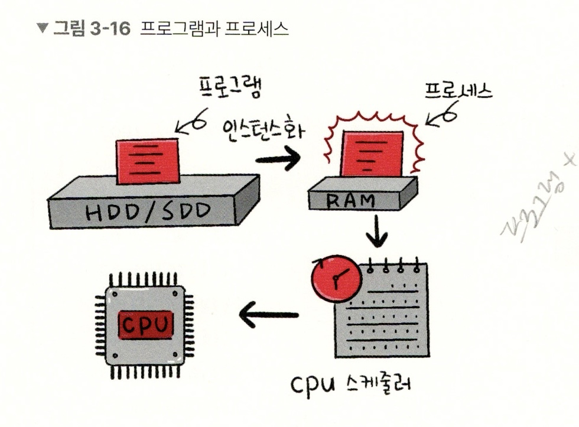
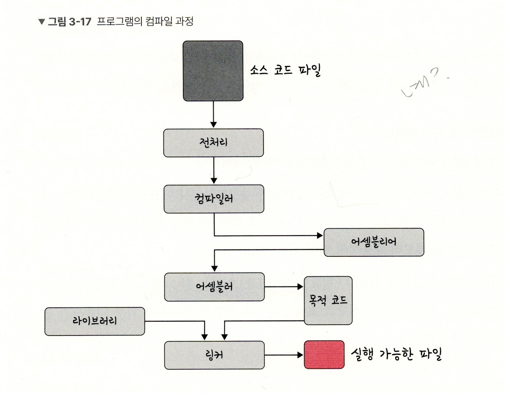
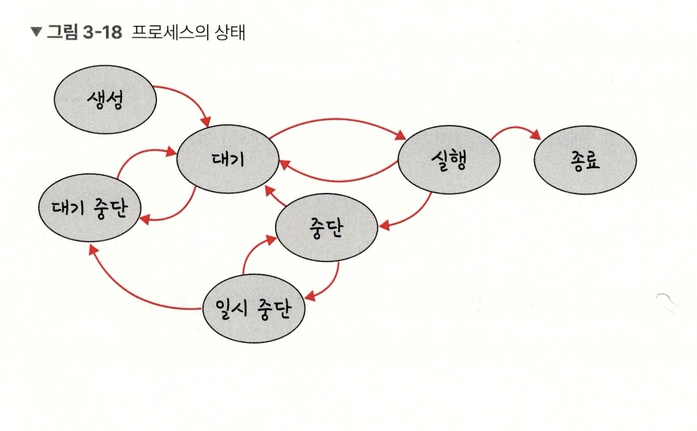
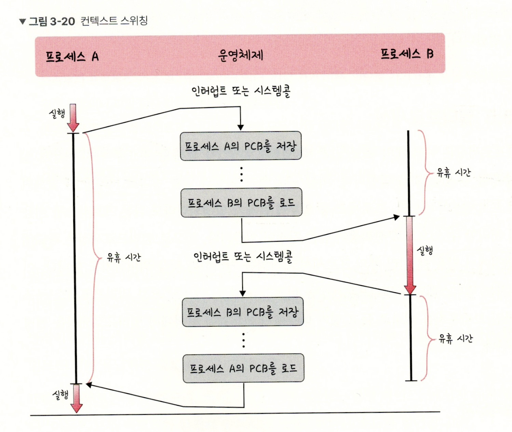
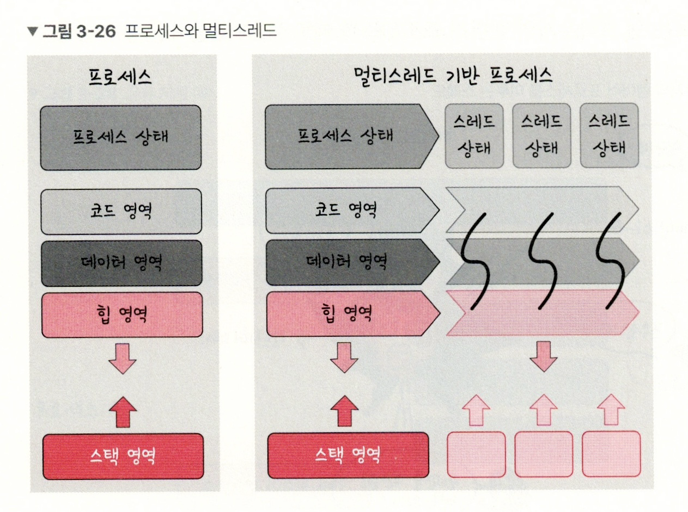
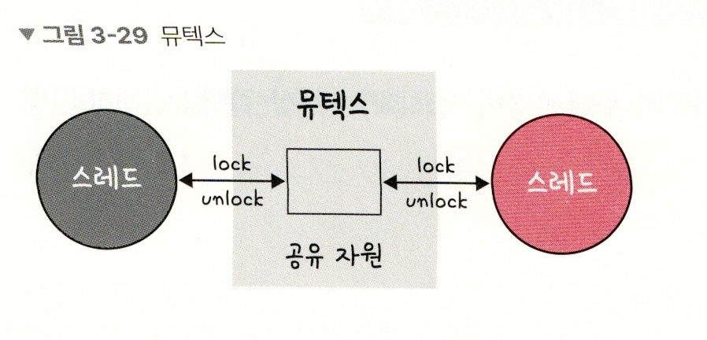
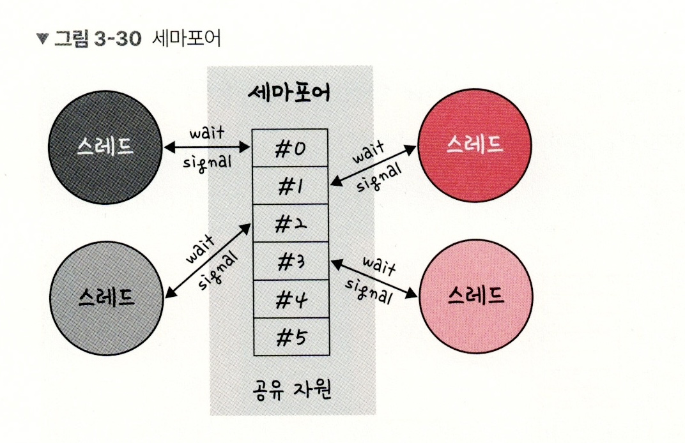
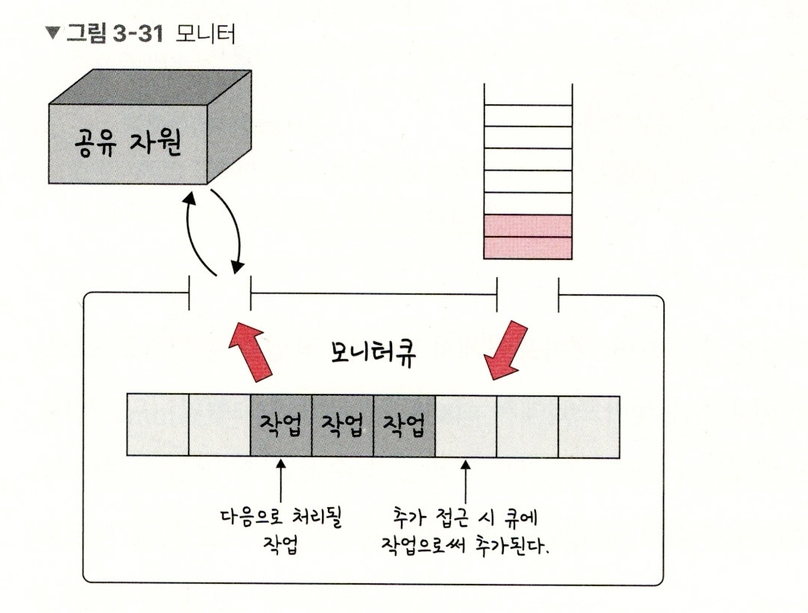

# 프로세스와 스레드

**프로세스** 
> 운영체제에서 실행 중인 하나의 '프로그램 단위'

**스레드** 
> 프로세스 내에서 실제 작업을 수행하는 '실행 단위'

<br><br>

1. 프로그램이 메모리에 적재 -> 프로세스(인스턴스화)
2. CPU가 프로세스 실행(CPU 스케줄러 기반)

<br>

---

<br>

## 프로세스와 컴파일 과정

### 프로세스 과정 예시

>프로그램 = chrome.exe(실행 파일)  
(사용 준비가 된 설계도)

>프로세스 = 실행 중인 '구글 크롬 창'

<br>

---

<br>

### 컴파일 과정

<br><br>

1. 전처리
: 소스 코드 주석 제거, [#include, #define]과 같은 헤더 파일 처리 -> 실제 코드로 확장(.i)

2. 컴파일러
: '오류 처리, 코드 최적화' 거쳐 어셈블리어로 변환(.s)

3. 어셈블러
: 어셈블리어 -> 기계어(오브젝트 파일)로 변환(.o)

4. 링커
; 다수의 오브젝트 파일 + 라이브러리를 묶어 하나의 실행 파일로 변환(.exe)

#### 📍 정적 라이브러리 & 동적 라이브러리

- 정적 라이브러리(도시락)  
: 라이브러리가 제공하는 '모든 코드'를 실행 파일에 넣는 방식
장점 -> 외부 의존도 낮음 / 단점 -> 메모리 효율성 저하

- 동적 라이브러리(식당)  
: 필요할 때만 (DLL이라는 함수 정보 통해) 참조하여 라이브러리 사용
장점 -> 메모리 효율성 / 단점 -> 외부 의존도 높음

<br>

---

<br>

## 프로세스의 상태

<br><br>

**흐름정리**
```scss
생성(New)
  ↓
대기(Ready) ←→ 대기 중단(Suspended Ready)
  ↓
실행(Running)
  ↓ ↓
중단(Blocked) ←→ 일시 중단(Suspended Blocked)
  ↓
종료(Terminated)
```

#### 📍 생성(New)  
> 프로세스가 생성된 상태, PCB 할당

  - fork() : '부모 프로세스 주소 공간' 복사하여, 자식 프로세스 생성
  - exec() : 새롭게 프로세스 생성

#### 📍 대기(Ready)  
> CPU 스케줄러로 부터 'CPU 소유권' 부여를 기다리는 상태

  - 메모리 공간 충분 -> 메모리 할당
  - 메모리 공간 불충분 -> 대기

#### 📍 대기 중단(Suspended Ready)  
> '메모리 부족'으로 일시 중단

#### 📍 실행(Running)  
> CPU 소유권 + 메모리 할당 이후, '인트랙션 수행 상태'(=CPU burst)

#### 📍 중단(Blocked)  
> 이벤트 발생으로 '프로세스 차단'된 상태

  - I/O 디바이스에 의한 인터럽트로 자주 발생  
  - -> 프린트 동작 시, 잠깜의 pause

#### 📍 일시 중단(Suspended Blocked)  
> 프로세스 실행하려고 하는데, '메모리 부족'으로 일시 중단 상태

#### 📍 종료(Terminated)  
> 운영체제가 프로세스의 메모리 + CPU 소유권 회수한 상태

#### 📍 강제종료(abort)  
> 부모 프로세스가 자식 프로세스를 강제

<br>

---

<br>

## 프로세스의 메모리 구조

```css
[높은 주소]

┌──────────────┐
│    스택       │  ← 함수 호출, 지역 변수 (동적 영역)
├──────────────┤
│     힙        │  ← malloc, new 등 동적 할당 (동적 영역)
├──────────────┤
│ BSS Segment  │  ← 초기값 없는 전역/정적 변수 (정적 영역)
├──────────────┤
│ Data Segment │  ← 초기값 있는 전역/정적 변수 (정적 영역)
├──────────────┤
│  코드 영역     │  ← 함수, 명령어 등 실행 코드 (정적 영역)
└──────────────┘

[낮은 주소]
```

<br>

---

<br>

### 스택 & 힙

스택  
> 함수 호출 시 생성되는 지역변수, 매개변수, 리턴 주소 등 저장
  - 함수가 끝나면 자동으로 정리
  - 정적 크기, 고정된 메모리 사용

힙  
> malloc, new와 같이 동적으로 메모리 할당할 때 사용
  - 크기 유동적, 메모리 부족 시 할당 실패 가능성o

<br>

---

<br>

### 데이터 영역 & 코드 영역

정적 할당 영역
> '컴파일 단계'에서 '메모리를 할당'하는 것

BSS 영역
> 초기값이 없는 전역 변수, static 변수 저장
  - 실행시 0으로 초기화

Data 영역
> '0'이 아닌 값으로 초기화된 변수 저장

Code 영역
> 프로그램의 코드

<br>

---

<br>


## PCB
> 운영체제에서 *프로세스에 대한 메타 데이터*를 저장한 데이터
  - 프로세스 생성 -> 운영체제가 PCB 생성
  - 커널 스택 가장 앞 부분에서 관리(일반 사용자 접근 못하도록)

### PCB의 구조

```css
┌──────────────────────────────┐
│ 프로세스 ID                 │ ← 고유한 번호
├──────────────────────────────┤
│ 프로세스 상태               │ ← 실행 중, 준비, 대기 등
├──────────────────────────────┤
│ 프로그램 카운터            │ ← 다음 실행할 명령어의 주소
├──────────────────────────────┤
│ CPU 레지스터                │ ← 문맥 교환 시 저장되는 레지스터 값
├──────────────────────────────┤
│ 메모리 관리 정보            │ ← 페이지 테이블, 세그먼트 정보 등
├──────────────────────────────┤
│ CPU 스케줄링 정보           │ ← 우선순위, 큐 위치 등
├──────────────────────────────┤
│ I/O 상태 정보               │ ← 열린 파일, 장치, 버퍼 등
├──────────────────────────────┤
│ 계정 정보                   │ ← CPU 사용 시간, 사용자 ID 등
├──────────────────────────────┤
│ 프로세스 권한               │ ← 사용자 권한, 접근 제어 정보 등
└──────────────────────────────┘
```

<br>

---

<br>

### 컨텍스트 스위칭
> 운영체제가 프로세스의 상태를 저장하고 로드시키는 과정(PCB 기반)

**실행 중이던 프로세스 상태 PCB에 저장 -> 다른 프로세스 PCB 로드해 복원**

<br><br>

+) 유휴시간 : CPU가 어떤 프로세스도 실행하지 않고, 놀고 있는 시간

<br>

*캐시미스 발생 과정*
1. CPU가 프로세스 A의 데이터를 캐시에 저장해두고 running 중
2. 운영체제가 컨텍스트 스위칭으로 프로세스 B로 전환
3. CPU 캐시의 'A 데이터'는 무용지물
4. 프로세스 B의 데이터는 다시 메모리에서 로드해야함 -> 캐시 미스 발생

+) 스레드에서도 '컨텍스트 스위칭' 발생 -> 비용 적고, 시간도 적게 걸림


<br>

---

<br>

## 멀티프로세싱
> 동시에 '여러 프로세스'를 처리하는 것

장점
- 병렬 처리 가능
- 처리 속도 향상
- 시스템 안정성 증가
- CPU 자원 활용도 향상

<br>

---

<br>

### 웹 브라우저

```css
[전체 시스템 구조]
┌────────────────────────────┐
│        브라우저 프로세스       │ ← 탭, 주소창, 뒤로가기, 탭 관리 등
├────────────────────────────┤
│      렌더러 프로세스 (n개)    │ ← HTML, CSS, JS 처리, 화면 그리기
├────────────────────────────┤
│      플러그인 프로세스        │ ← Flash 등 외부 확장 기능
├────────────────────────────┤
│        GPU 프로세스           │ ← 하드웨어 가속 렌더링, 2D/3D 처리
└────────────────────────────┘
```

- 브라우저 프로세스(두뇌)  
  : 사용자 인터페이스 전체 담당(네트워크 요청, 파일 접근)

- 렌더러 프로세스(손&눈)   
  : 웹 페이지를 실제로 해석, 화면으로 그려주기

- 플러그인 프로세스(도구 상자)   
  : 웹 표준 아닌 기능 별도 제공

- GPU 프로세스(그래픽 엔진)   
  : GPU 통한 렌더링 속도 향상

<br>

---

<br>

### IPC
> 서로 다른 프로세스들이 정보를 주고 받는 방법

#### 📍 공유 메모리
> 메모리 공간을 여러 프로세스가 공동으로 사용
  - 장점 -> '메모리 자체를 관리'하기 때문에 속도 빠름
  - 동기화 필요(동기화가 어려운 것이 단점)

#### 📍 파일
> 디스크에 저장된 데이터 / 서버에서 제공한 데이터

#### 📍 소켓
> 타 프로세스, 네트워크의 다른 컴퓨터로 전송하는 데이터(네트워크 인터페이스 통해)
  - TCP / UDP

#### 📍 익명 파이프
> 임시 공간 파이프 기반으로 데이터 전송(단방향)
  - 부모-자식 프로세스 간에서만 사용, 다른 네트워크x

#### 📍 명명 파이프
> 파이프 서버 - 하나 이상 파이프 클라이언트 간 통신(단방향, 양방향)
  - 타 네트워크와 통신 가능
  - 여러 개 파이프 동시 사용

#### 📍 메시지 큐
> 메시지를 '큐' 형태로 관리하는 것
  - 사용방법 간단
  - 기능 구현이 복잡할 때 대안으로 사용


<br>

---

<br>

## 스레드와 멀티스레딩

### **스레드란?**
>  프로세스의 실행 가능한 '가장 작은 단위'

<br><br>

### **멀티스레딩**
> 하나의 프로세스 내에서 여러 스레드를 생성해 동시에 작업 수행하는 방식

<br>

**멀티 스레딩 구조**

```css
[하나의 프로세스]
┌────────────────────┐
│  코드/데이터/힙 공유      │  ← 공통 메모리 공간
│  ┌──────────────┐ │
│  │ 스레드1 (Stack) │
│  ├──────────────┤
│  │ 스레드2 (Stack) │
│  ├──────────────┤
│  │ 스레드3 (Stack) │
│  └──────────────┘
└────────────────────┘

```
<br>

장점 : 메모리 절약 / 속도 향상 / 반응성 향상  
단점 : 동기화 문제 / 디버깅 어려움 / 하나가 죽으면 전체 영향o

<br>

**멀티스레드 예시(렌더러 프로세스)**

```css
[렌더러 프로세스 내부]
┌────────────────────────────┐
│    📄 메인 스레드            │ ← HTML 파싱, DOM 조작, 이벤트 처리
│    🎨 컴포지터 스레드       │ ← 화면 합성 (레이어 조립)
│    🖼 래스터 스레드         │ ← 이미지, 텍스트 등 픽셀 렌더링
│    📜 자바스크립트 엔진 스레드│ ← JS 실행 (예: V8 엔진)
│    ⏳ I/O 스레드             │ ← 네트워크 요청, 파일 등
└────────────────────────────┘

```

<br>

---

<br>


## 공유 자원과 임계 영역

### 공유 자원
> 시스템 안에서 '프로세스 + 스레드'가 *함께 접근할 수 있는* 자원 혹은 변수

경쟁 상태  
> 두 개 이상의 프로세스가 '공유 자원'을 읽거나 쓰는 상황


<br>

---

<br>

### 임계 영역
> 둘 이상의 프로세스, 스레드가 공유 자원에 접근 시, '결과가 달라지는' 코드 영역

<br>

**임계 영역 해결 위해 만족해야 하는 조건 세 가지**
1. 상호 배제 : 한 프로세스가 임계 영역에 들어갔을 때 다른 프로세스는 출입 불가능
2. 한정 대기 : 특정 프로세스가 영원히 임계 영역에 들어가지 못하면 안된다
3. 융통성 ; 만약 어떠한 프로세스도 임계 영역을 사용하지 않는다면, 임계 영역 외부의 어떠한 프로세스도 들어갈 수 없으며, 이 때 프로세스끼리 서로 방해하지 않는다.

#### 📍임계 영역 해결 방법(동기화 기법)

<br><br>

- 뮤텍스  
: 한 번에 하나의 스레드만 임계 영역에 진입할 수 있도록 하는 락(lock)
  - 락 획득 시, 다른 스레드는 블로킹
  - unlock 해야, 다른 스레드 진입 가능
  - 소유 개념o(락을 건 스레드만 unlock 가능)  

<br><br>

- 세마포어  
: 동시에 접근 가능한 *허용량*을 관리하는 정수 값
  - N개의 자원을 동시에 사용할 수 있도록 제어(뮤텍스의 일반화)
  - 세마포어 값 = 0 이면 대기, 양수면 진입 가능


  > wait() -> 차례를 기다리는 함수  
  > signal() -> 다음 프로세스로 순서 넘겨주는 함수

  1. 바이너리 세마포어
  : 0과 1 만 가질 수 있는 세마포어
  신호 메커니즘
  ex) 전화 수신 시, 듣던 노래 종료

  2. 카운팅 세마포어
  : 여러 개의 값을 가진 세마포어
  여러 자원에 대한 접근 제어

<br><br>

- 모니터
: 임계 영역을 자동으로 보호해주는 고급 동기화 객체
  - 구현 용이, 상호 배제 자동
  - 락 + 임계 영역 + 조건 변수 포함

<br>

---

<br>


## 교착 상태
> 두 개 이상의 프로세스들이 서로 가진 자원을 기다리며 '중단된 상태'


### 교착 상태의 원인

- 상호 배제
: 한 프로세스가 자원 독점, 다른 프로세스는 접근 불가능

- 점유 대기
: 특정 프로세스가 점유한 자원을 다른 프로세스가 요청

- 비선점
: 다른 프로세스의 자원을 강제적으로 가져오지 못함

- 환형 대기
: 프로세스 A -> 프로세스 B 자원 요구
프로세스 B -> 프로세스 A 자원 요구하는 상황

### 교착 상태 해결 방법

1. 자원 할당 시, 조건이 성립되지 않도록 설계
2. 교착 상태 가능성 없을 때만 자원 할당, '은행원 알고리즘' 사용
3. 교착 상태 발생 시, 사이클 탐색하고 관련 프로세스 하나씩 삭제
4. 교착 상태 발생 시, 작업 종료(응답 없음 화면)

+) 은행원 알고리즘  
: 총 자원의 양 + 현재 할당한 자원의 양을 기준으로 안정/불안정 상태를 나누어 안정 상태로 가도록 자원을 할당하는 알고리즘